## Project 2: Use a lib (jQuery) to consume a web service

Create a web presence for the IST Department - similar to http://www.ist.rit.edu. All of the information in the IST site is in the api, including the map data. Extend the basic jQuery with at least 3 plug-ins that add functionality to your site. 

*Note: This website is linked at briennakh.github.io/client-side-development, but GitHub pages cannot host non-static files such as the proxy.php file in this project. I have included a partial screenshot demo below of the website when it is run locally.*

### Screenshot demo:

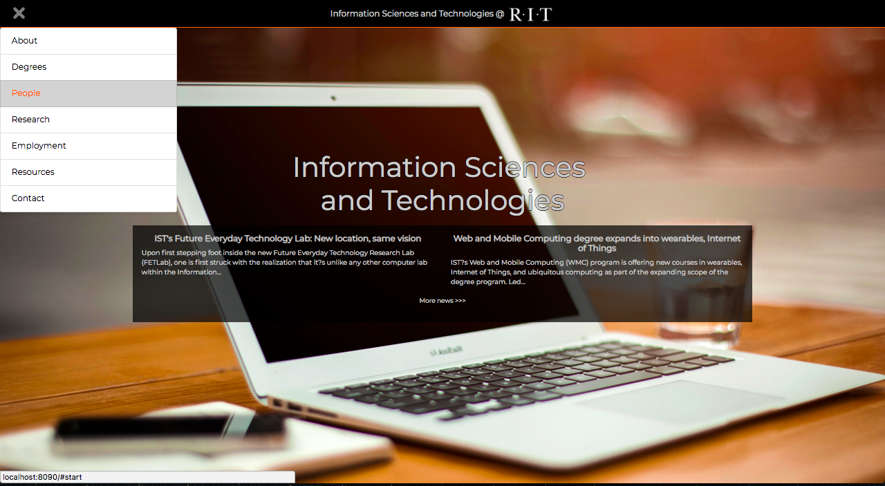
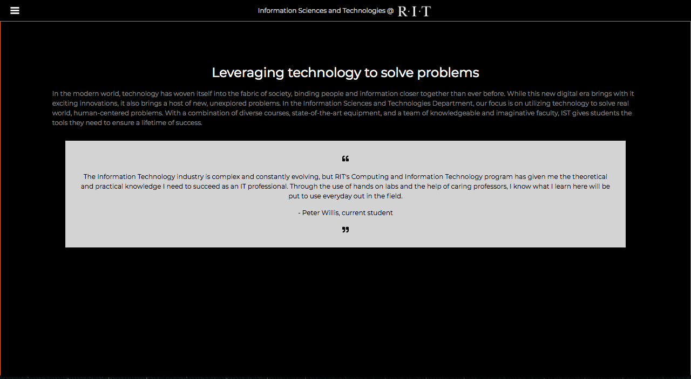
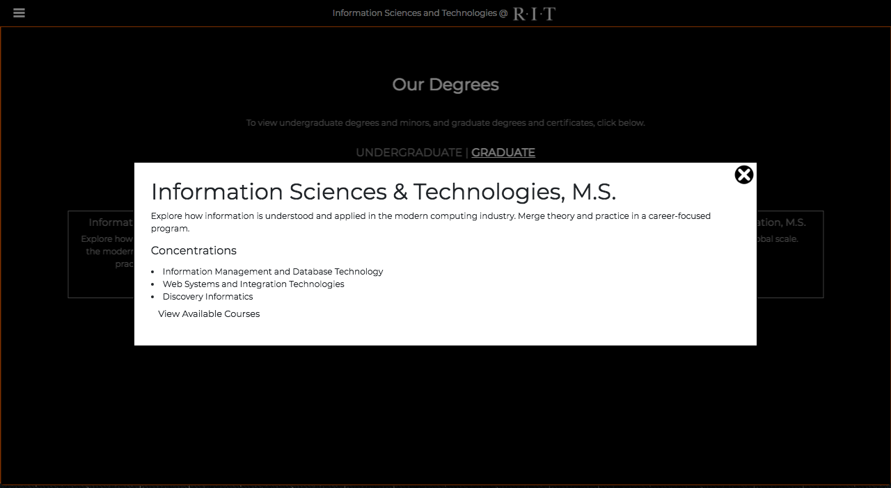
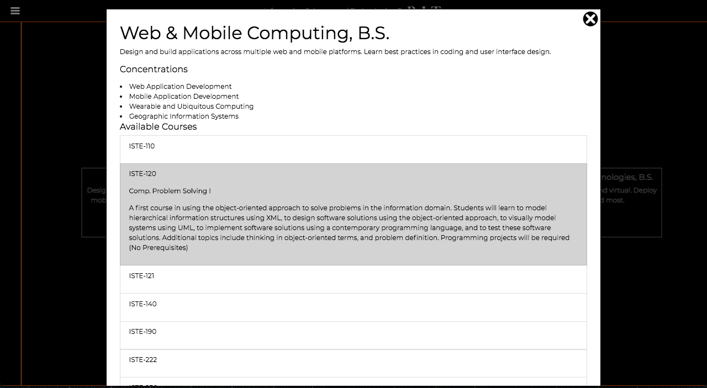
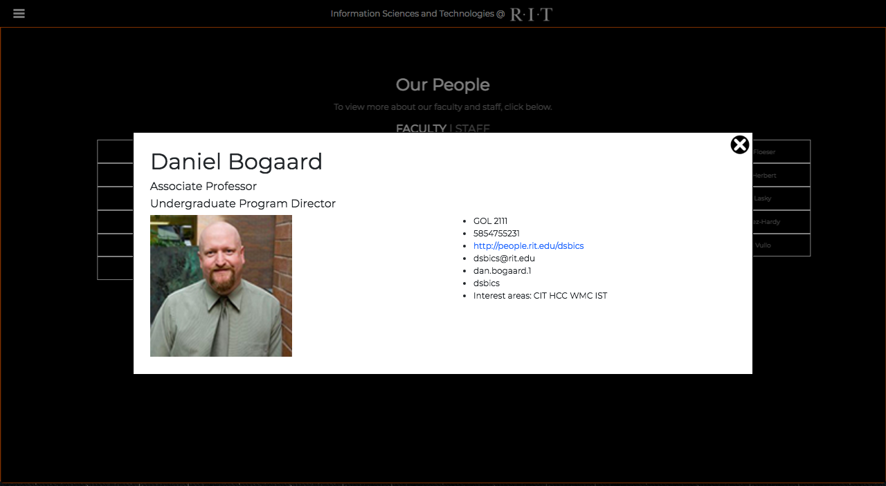
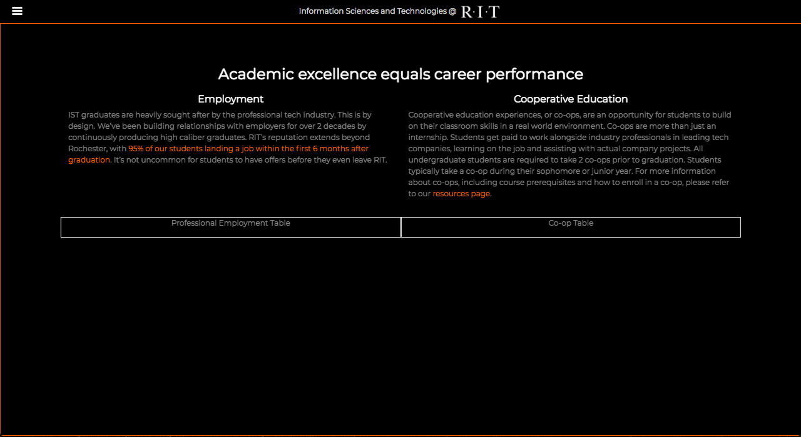
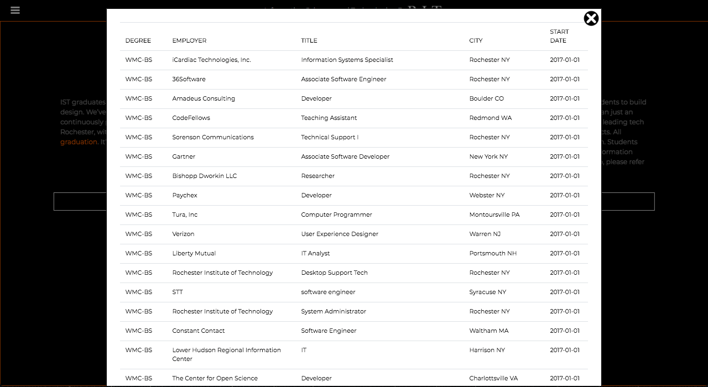
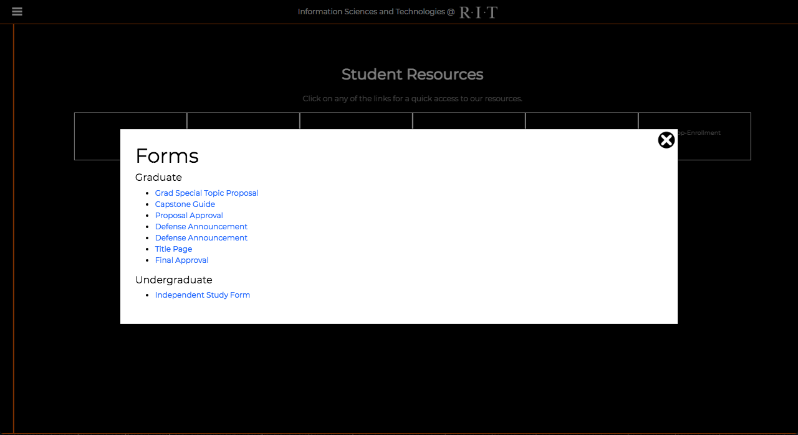
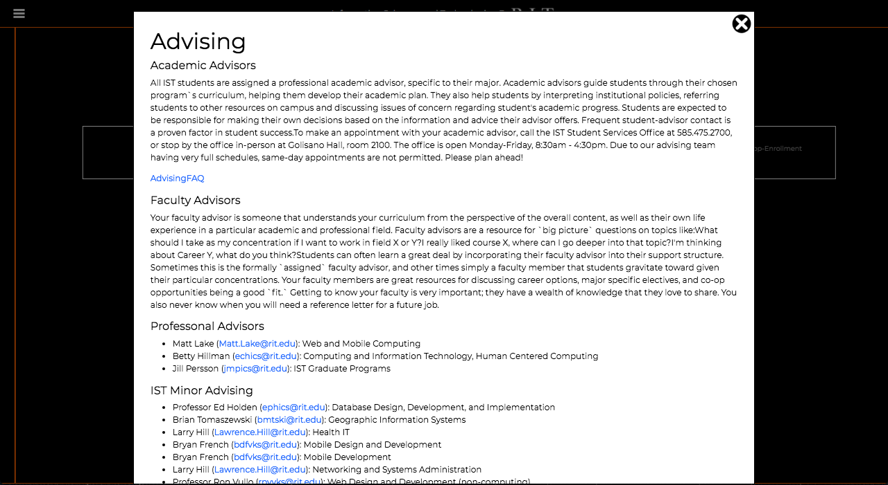
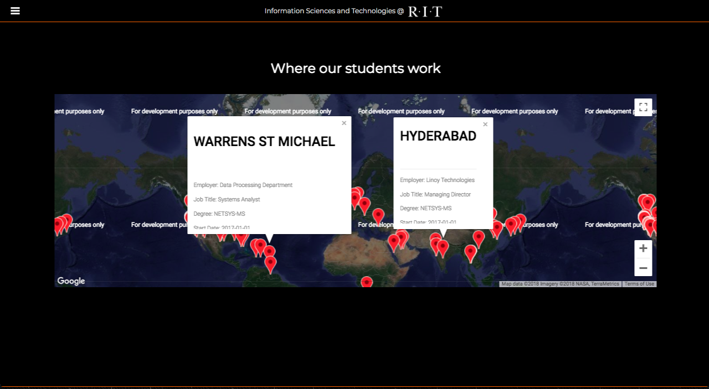
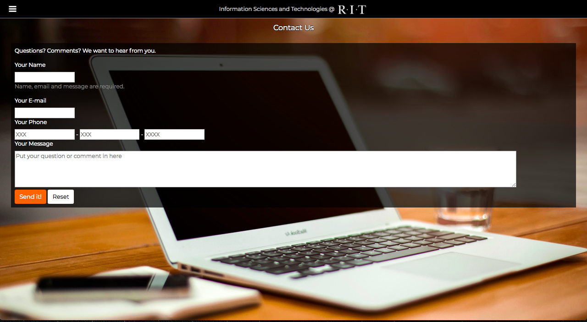